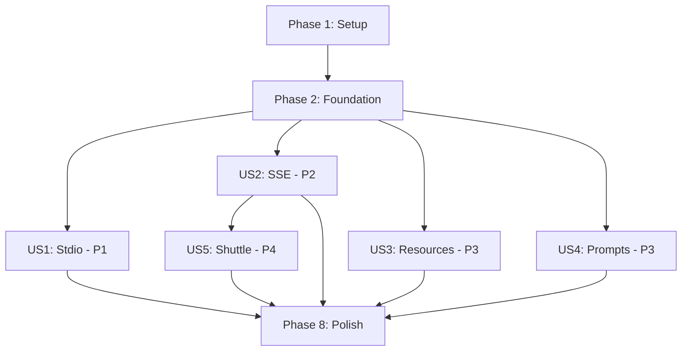

# Tasks: MCP Server Integration

**Input**: Design documents from `/specs/009-mcp-server-integration/`
**Prerequisites**: plan.md, spec.md, research.md, data-model.md, quickstart.md

**Tests**: Optional - not explicitly requested, so excluded from this task list

**Organization**: Tasks grouped by user story for independent implementation

## Format: `- [ ] [ID] [P?] [Story] Description`
- **[P]**: Parallelizable (different files, no dependencies)
- **[Story]**: User story label (US1, US2, US3, US4, US5)
- File paths: `providers/binance-rs/src/...`

---

## Phase 1: Setup (Shared Infrastructure)

**Purpose**: Project initialization and dependency configuration

- [ ] T001 Add rmcp 0.8.1 dependency to providers/binance-rs/Cargo.toml with features: server, macros, transport-io, transport-sse-server
- [ ] T002 [P] Add axum 0.8.6 dependency to providers/binance-rs/Cargo.toml with features: ws, macros
- [ ] T003 [P] Add schemars 1.0.4 dependency to providers/binance-rs/Cargo.toml with features: chrono04
- [ ] T004 [P] Add uuid 1.11 dependency to providers/binance-rs/Cargo.toml with features: v4, serde
- [ ] T005 Create providers/binance-rs/src/mcp/mod.rs with module exports
- [ ] T006 Create providers/binance-rs/src/transport/mod.rs with module exports
- [ ] T007 Update providers/binance-rs/src/lib.rs to export mcp and transport modules
- [ ] T008 Add feature flags to providers/binance-rs/Cargo.toml: mcp_server, sse (conditional on mcp_server)

---

## Phase 2: Foundational (Blocking Prerequisites)

**Purpose**: Core infrastructure needed by all user stories

**⚠️ CRITICAL**: Complete before starting any user story work

- [ ] T009 Create providers/binance-rs/src/mcp/types.rs with Parameter structs and JsonSchema derives
- [ ] T010 [P] Create providers/binance-rs/src/mcp/server.rs with BinanceServer struct (client, orderbook_manager fields)
- [ ] T011 Implement MCP error conversion helpers in providers/binance-rs/src/error.rs (ErrorData::internal_error)
- [ ] T012 Create providers/binance-rs/src/transport/mod.rs with TransportMode enum (Stdio, Sse, Grpc)
- [ ] T013 Update providers/binance-rs/src/main.rs to add --stdio, --sse, --grpc CLI flags (cl app or structopt)

**Checkpoint**: Foundation ready - user story implementation can begin

---

## Phase 3: User Story 1 - MCP Protocol Support via Stdio (Priority: P1) 🎯 MVP

**Goal**: Enable Claude Desktop to connect via stdio and execute tools

**Independent Test**: Configure Claude Desktop, connect via stdio, call tools/list and get_ticker

### Implementation for User Story 1

- [ ] T014 [P] [US1] Implement ServerHandler trait in providers/binance-rs/src/mcp/server.rs (get_info method)
- [ ] T015 [P] [US1] Create tool router in providers/binance-rs/src/mcp/handler.rs with #[tool_router] macro
- [ ] T016 [US1] Add #[tool] macro wrappers for existing tools in providers/binance-rs/src/mcp/handler.rs (get_ticker, get_orderbook, etc.)
- [ ] T017 [US1] Implement stdio transport setup in providers/binance-rs/src/transport/stdio.rs (rmcp::transport::stdio)
- [ ] T018 [US1] Update main.rs to handle --stdio flag and serve via stdio transport
- [ ] T019 [US1] Configure tracing to write to stderr (stdout reserved for MCP protocol)
- [ ] T020 [US1] Test stdio mode: verify initialize, tools/list, tools/call work correctly

**Checkpoint**: Stdio mode works - can connect from Claude Desktop and execute all tools

---

## Phase 4: User Story 2 - SSE Transport for Remote Access (Priority: P2)

**Goal**: Enable remote HTTPS access via Server-Sent Events transport

**Independent Test**: Start with --sse, connect via curl, send MCP messages with session ID

### Implementation for User Story 2

- [ ] T021 [P] [US2] Create providers/binance-rs/src/transport/sse/types.rs with ConnectionId and SessionMetadata structs
- [ ] T022 [P] [US2] Create providers/binance-rs/src/transport/sse/session.rs with SessionManager (Arc<RwLock<HashMap>>)
- [ ] T023 [US2] Implement session lifecycle methods in SessionManager (register, update_activity, cleanup_stale)
- [ ] T024 [P] [US2] Create providers/binance-rs/src/transport/sse/server.rs with SseConfig struct and heartbeat task
- [ ] T025 [P] [US2] Create providers/binance-rs/src/transport/sse/handlers.rs with HTTP endpoint handlers (POST /mcp/sse, POST /mcp/message)
- [ ] T026 [US2] Implement MCP message routing in handlers.rs (extract Mcp-Session-Id header, lookup session, route to ServerHandler)
- [ ] T027 [US2] Add SSE feature flag setup in main.rs (build axum router, start server on --sse flag)
- [ ] T028 [US2] Implement 30s session timeout and max 50 connection limit in SessionManager
- [ ] T029 [US2] Add health endpoint GET /health to SSE server
- [ ] T030 [US2] Test SSE mode: verify handshake, session creation, message routing, timeout, connection limit

**Checkpoint**: SSE mode works - remote clients can connect and execute tools over HTTPS

---

## Phase 5: User Story 3 - MCP Resources for Efficient Data Access (Priority: P3)

**Goal**: Provide fast resource-based access to market data

**Independent Test**: Call resources/list, then read binance://market/btcusdt - verify markdown response

### Implementation for User Story 3

- [ ] T031 [P] [US3] Create providers/binance-rs/src/mcp/resources.rs with ResourceCategory enum (Market, Account, Orders)
- [ ] T032 [P] [US3] Implement ResourceUri parser in resources.rs (parse binance://category/identifier)
- [ ] T033 [US3] Implement list_resources method in server.rs (return RawResource list for market data, account, orders)
- [ ] T034 [P] [US3] Implement read_market_resource helper (fetch ticker data, format as markdown)
- [ ] T035 [P] [US3] Implement read_account_resource helper (fetch balances, format as markdown table)
- [ ] T036 [P] [US3] Implement read_orders_resource helper (fetch open orders, format as markdown table)
- [ ] T037 [US3] Implement read_resource method in server.rs (dispatch to category handlers)
- [ ] T038 [US3] Add resource capability to ServerCapabilities in get_info method
- [ ] T039 [US3] Test resources: verify list returns correct URIs, read returns formatted markdown

**Checkpoint**: Resources work - agents can efficiently access market data via URIs

---

## Phase 6: User Story 4 - MCP Prompts for Trading Analysis (Priority: P3)

**Goal**: Provide guided analysis workflows through prompts

**Independent Test**: Call prompts/list, then request trading_analysis prompt - verify structured response

### Implementation for User Story 4

- [ ] T040 [P] [US4] Create providers/binance-rs/src/mcp/prompts.rs with prompt parameter structs (TradingAnalysisArgs, etc.)
- [ ] T041 [P] [US4] Implement prompt router with #[prompt_router] macro in prompts.rs
- [ ] T042 [P] [US4] Implement trading_analysis prompt with #[prompt] macro (fetch data, format markdown guidance)
- [ ] T043 [P] [US4] Implement portfolio_risk prompt (analyze balances, format risk assessment)
- [ ] T044 [P] [US4] Implement market_microstructure_analysis prompt (#[cfg(feature = "orderbook_analytics")])
- [ ] T045 [US4] Add prompt capability to ServerCapabilities in get_info method
- [ ] T046 [US4] Attach prompt router to ServerHandler impl with #[prompt_handler] attribute
- [ ] T047 [US4] Test prompts: verify list returns all prompts, get returns structured markdown

**Checkpoint**: Prompts work - agents receive guided analysis workflows

---

## Phase 7: User Story 5 - Shuttle.dev Cloud Deployment (Priority: P4)

**Goal**: Enable one-command deployment to Shuttle.dev

**Independent Test**: Run shuttle deploy, verify HTTPS endpoint works with SSE transport

### Implementation for User Story 5

- [ ] T048 [P] [US5] Add shuttle-runtime and shuttle-axum dependencies to Cargo.toml (optional, under shuttle-runtime feature)
- [ ] T049 [P] [US5] Create Shuttle.toml configuration file in providers/binance-rs/ (project name, version)
- [ ] T050 [US5] Add #[shuttle_runtime::main] function in main.rs (#[cfg(feature = "shuttle-runtime")])
- [ ] T051 [US5] Implement secret loading from shuttle_runtime::SecretStore (BINANCE_API_KEY, BINANCE_SECRET_KEY)
- [ ] T052 [US5] Return shuttle_axum::ShuttleAxum with SSE server router
- [ ] T053 [US5] Test deployment: shuttle deploy, verify HTTPS endpoint, test MCP over SSE

**Checkpoint**: Shuttle deployment works - provider runs in cloud with automatic HTTPS

---

## Phase 8: Polish & Cross-Cutting Concerns

**Purpose**: Final touches and documentation

- [ ] T054 [P] Add comprehensive logging for MCP operations (initialize, tools/call, resources/read, prompts/get)
- [ ] T055 [P] Update README.md with MCP integration documentation (stdio setup, SSE setup, Shuttle deployment)
- [ ] T056 [P] Add example Claude Desktop config to docs/claude-desktop-config.json
- [ ] T057 [P] Add example SSE client script to docs/test-sse-client.sh
- [ ] T058 Run full test suite: cargo test --features "mcp_server,sse,orderbook,orderbook_analytics"
- [ ] T059 Build release binary: cargo build --release --features "mcp_server,sse,orderbook_analytics"
- [ ] T060 Manual integration test: Connect Claude Desktop, verify all tools/resources/prompts work

---

## Dependencies (Story Completion Order)

**Note**: US1-US4 can be developed in parallel after Phase 2. US5 depends on US2.

---

## Parallel Execution Examples

### Phase 1 (Setup)
Run T002, T003, T004 in parallel (independent dependency additions)

### Phase 2 (Foundation)
Run T009, T010 in parallel (types and server struct are independent)

### User Story 1 (Stdio)
Run T014, T015 in parallel (ServerHandler and tool router are independent until T016)

### User Story 2 (SSE)
Run T021, T022, T024, T025 in parallel (types, SessionManager, server config, handlers - all independent files)

### User Story 3 (Resources)
Run T031, T032, T034, T035, T036 in parallel (all independent resource handlers)

### User Story 4 (Prompts)
Run T040, T041, T042, T043, T044 in parallel (prompt definitions are independent)

### User Story 5 (Shuttle)
Run T048, T049 in parallel (dependencies and config file are independent)

### Polish Phase
Run T054, T055, T056, T057 in parallel (all documentation tasks)

---

## Implementation Strategy

**MVP Scope (Minimum Viable Product)**: User Story 1 only
- Phases 1, 2, 3 (T001-T020)
- Delivers: Stdio mode with Claude Desktop integration
- Testable: Configure Claude Desktop, execute tools

**Incremental Delivery**:
1. **Sprint 1**: MVP (US1 - Stdio mode)
2. **Sprint 2**: US2 (SSE remote access)
3. **Sprint 3**: US3 + US4 (Resources and Prompts - can run in parallel)
4. **Sprint 4**: US5 + Polish (Shuttle deployment and final touches)

**Task Count**:
- Phase 1 (Setup): 8 tasks
- Phase 2 (Foundation): 5 tasks
- US1 (Stdio - P1): 7 tasks
- US2 (SSE - P2): 10 tasks
- US3 (Resources - P3): 9 tasks
- US4 (Prompts - P3): 8 tasks
- US5 (Shuttle - P4): 6 tasks
- Phase 8 (Polish): 7 tasks
- **Total**: 60 tasks

**Parallel Opportunities**: 25 parallelizable tasks (marked with [P])

**Format Validation**: ✅ All tasks follow checklist format with checkbox, ID, optional [P], required [Story] for user story tasks, and file paths
